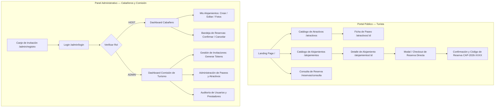

# Arquitectura de Software Frontend (SDD) — Turismo Capilla del Monte

Este documento define la arquitectura integral, el mapa de información, los patrones de diseño y la estrategia de componentes para el frontend de la plataforma.

---

## 1. Visión y Objetivos Arquitectónicos

1. **Rendimiento Máximo y SEO para el Turista:** La experiencia pública debe cargar en menos de 1 segundo en dispositivos móviles y conexiones 4G/3G de montaña, con indexación perfecta en motores de búsqueda.
2. **Interactividad Dinámica para el Prestador:** El panel de gestión de reservas y cabañas debe ofrecer una experiencia fluida tipo aplicación de escritorio (SPA).
3. **Identidad Visual Autóctona (Anti-AI Slop):** Rechazar patrones genéricos de plantillas de inteligencia artificial (degradados violetas, formas flotantes sin sentido) y adoptar una dirección de arte basada en los colores minerales, las sierras y la calidez de Capilla del Monte.
4. **Mantenibilidad y Atomic Design:** Jerarquía clara de componentes (Átomos, Moléculas, Organismos) desacoplados de la capa de transporte HTTP.

---

## 2. Topología de la Aplicación en el Monorepo

Para evitar la sobreingeniería de mantener dos aplicaciones separadas con paquetes compartidos complejos, se adopta una arquitectura unificada en `apps/frontend` basada en **Astro 5 + React (Arquitectura de Islas)**:

```text
apps/frontend/
├── public/                       # Assets estáticos (logos, fuentes, favicon)
├── src/
│   ├── assets/                   # Imágenes optimizadas y vectores
│   ├── components/               # Jerarquía de Componentes
│   │   ├── ui/                   # Átomos y moléculas (Botones, Inputs, Badges, Modales, Tabs)
│   │   ├── common/               # Header, Footer, Navbar, Breadcrumbs
│   │   ├── portal/               # Organismos del portal público (Buscador, Cards de Paseos, Checkout)
│   │   └── admin/                # Organismos del panel privado (Tablas de reservas, Formularios, Sidebar)
│   ├── layouts/                  # Plantillas base (PublicLayout.astro, AdminLayout.tsx)
│   ├── pages/                    # Enrutamiento basado en archivos
│   │   ├── index.astro           # Landing Page principal
│   │   ├── atractivos/           # Catálogo y fichas de paseos
│   │   │   ├── index.astro       # Catálogo con filtros
│   │   │   └── [id].astro        # Ficha técnica del atractivo
│   │   ├── alojamientos/         # Catálogo de hospedajes
│   │   │   ├── index.astro       # Catálogo con buscador reactivo de disponibilidad
│   │   │   └── [id].astro        # Detalle de la cabaña y motor de reserva
│   │   ├── reservas/
│   │   │   └── consulta.astro    # Búsqueda pública de reserva por código y correo
│   │   └── admin/                # Panel Administrativo SPA (React Router montado en isla cliente)
│   │       ├── [...slug].astro   # Captura todas las rutas del dashboard admin
│   │       └── AdminApp.tsx      # Entrypoint React del panel con rutas protegidas y Zustand/Query
│   ├── styles/                   # Configuración de Tailwind y variables CSS
│   │   ├── tokens.css            # Paleta cromática, elevaciones, bordes y tipografía
│   │   └── global.css
│   ├── services/                 # Clientes API tipados (comunicación con backend NestJS)
│   │   ├── api.client.ts         # Axios/Fetch configurado con interceptores de JWT
│   │   ├── auth.service.ts
│   │   ├── accommodations.service.ts
│   │   ├── bookings.service.ts
│   │   └── attractions.service.ts
│   └── stores/                   # Estado global liviano en React (Zustand para auth y carrito)
├── astro.config.mjs              # Configuración de Astro con integración @astrojs/react y @astrojs/tailwind
└── package.json
```

### Ventajas de esta Topología:
* **Un único servidor de desarrollo:** Corre en un solo puerto (`4321` o `3000`), sin problemas de CORS local con el backend.
* **Componentes UI 100% Compartidos:** Los mismos botones, inputs y estilos se usan tanto en el portal público como en el panel privado.
* **Isla Interactiva para el Admin:** El dashboard admin se monta como un componente React completo (`<AdminApp client:only="react" />`), comportándose como una SPA rápida con navegación instantánea.

---

## 3. Mapa de Información y Navegación (User Flows)



---

## 4. Design System: Identidad Visual y Principios Anti-AI Slop

### 4.1 Principios de Dirección de Arte
1. **Paleta Cromática Autóctona:** Inspirada en la geología y flora del Valle de Punilla.
   * **Terracota Los Terrones (`primary`):** `#9C4A2F` / `#803820` — Cálido, mineral, representa la tierra y la piedra rojiza.
   * **Verde Monte Serrano (`secondary`):** `#2D5A43` / `#1F3E2E` — Naturaleza, tranquilidad, senderismo.
   * **Cielo Uritorco (`accent`):** `#3A758C` / `#295566` — Ríos de agua cristalina y mística serrana.
   * **Neutros Cálidos (`surface` / `background`):** `#FAF8F5` (Piedra caliza clara) y `#22201E` (Grafito oscuro para tipografía con contraste 12:1).
2. **Reglas Anti-AI Slop (Estricto):**
   * ❌ **PROHIBIDO:** Degradados violeta-azul con brillo neón (`purple-indigo-pink gradients`).
   * ❌ **PROHIBIDO:** Tarjetas con bordes ultra-redondeados gigantes (`rounded-3xl` en todo) y sombras etéreas sin profundidad física.
   * ❌ **PROHIBIDO:** Ilustraciones 3D genéricas de personas con cabezas gigantes o globos flotantes.
   * ✅ **PERMITIDO Y REQUERIDO:** Fotografía real y de alta resolución de Capilla del Monte, tipografía con jerarquía artesanal, micro-interacciones sutiles con tiempos de respuesta físicos (200-300ms con curvas de aceleración `cubic-bezier(0.16, 1, 0.3, 1)`).

### 4.2 Tipografía
* **Títulos y encabezados destacados:** `Outfit` o `Playfair Display` (elegancia, turismo de calidad, identidad).
* **Cuerpo de texto y números de tarifas:** `Plus Jakarta Sans` o `Inter` (máxima legibilidad en pantallas táctiles y números tabulares para precios).

---

## 5. Estrategia de Animaciones y Micro-Interacciones

* **Librería seleccionada:** **Tailwind CSS Transitions** para el 90% de la interfaz (cero peso en el bundle) + **GSAP (GreenSock)** cargado bajo demanda exclusivamente en la Landing Page para:
  * Efecto parallax sutil en el hero del Cerro Uritorco.
  * Transición fluida en la barra flotante de búsqueda de disponibilidad.
  * Revelación secuencial (stagger) de las tarjetas de paseos.

---

## 6. Decisión Arquitectónica (ADR): Transición de Astro a React SPA (Vite) y Mitigación de SEO

### 6.1 Contexto y Criterio de Cátedra
Por requerimiento pedagógico y curricular de la cátedra de **Programación III**, se estableció la restricción formal de **no utilizar meta-frameworks orientados a SSR/SSG (como Astro o Next.js)**, con el objetivo de evaluar directamente el dominio de arquitecturas Single Page Application (SPA) basadas en **React puro + Vite**, patrones de componentes (Container-Presentational), custom hooks, gestión de estado en cliente y enrutamiento dinámico (`react-router-dom`).

### 6.2 Desafío de SEO en una SPA Tradicional
Una SPA basada puramente en Client-Side Rendering (CSR) presenta desafíos conocidos para el posicionamiento orgánico:
1. **Rastreo diferido:** Los motores de búsqueda (Googlebot) rastrean el HTML inicial (`<div id="root"></div>`) antes de programar la ejecución del bundle JavaScript, lo que puede demorar la indexación de contenidos dinámicos.
2. **Scrapers de redes sociales sin motor JS:** Clientes como WhatsApp, Telegram, Twitter/X y Facebook no ejecutan JavaScript al generar tarjetas de previsualización (OpenGraph). Si el HTML base no contiene metadatos estáticos, el enlace compartido carece de portada, título y descripción.

### 6.3 Estrategia de Mitigación y Optimización de SEO en React + Vite
Para garantizar un posicionamiento orgánico de primer nivel sin depender de frameworks especializados en SSR, se aplica una estrategia técnica en cuatro capas:

1. **Metadatos Estáticos y OpenGraph en `index.html`:**
   - Inyección directa en el HTML de entrada de etiquetas canónicas `<title>`, `<meta name="description">` y protocolo OpenGraph (`og:title`, `og:image`, `og:description`, `og:locale="es_AR"`).
   - Garantiza que al compartir enlaces del portal en WhatsApp o redes sociales, la tarjeta visual con la fotografía de Capilla del Monte se procese al instante sin requerir ejecución de scripts.

2. **Marcado Estructurado JSON-LD (Schema.org):**
   - Incorporación de un bloque estático `<script type="application/ld+json">` modelando las entidades oficiales `TouristDestination` y `LodgingBusiness`, con:
     - Nombre oficial, descripción geográfica (Valle de Punilla, Córdoba) y coordenadas GPS.
     - Tipos de experiencias (turismo de naturaleza, mística del Uritorco, astroturismo).
   - Permite a Google y Bing indexar la información como datos enriquecidos (Rich Snippets / Knowledge Graph).

3. **Pre-renderizado Estático en Build-time:**
   - Generación de snapshots HTML para las rutas públicas estáticas (`/`, `/alojamientos`, `/atractivos`) durante el comando de compilación de Vite.
   - El crawler recibe HTML semántico completo con encabezados, párrafos y enlaces listos para indexar, mientras que el usuario final disfruta de la navegación instantánea de la SPA una vez montado React.

4. **Optimización Extrema de Core Web Vitals (CWV):**
   - El ranking de Google premia fuertemente la velocidad y estabilidad visual (LCP < 1.2s, CLS = 0, INP < 100ms).
   - Dimensiones fijas con `aspect-ratio` en todas las imágenes de la galería y tarjetas para erradicar el movimiento involuntario de layout (CLS).
   - Carga diferida (`loading="lazy"`, `decoding="async"`) y compresión WebP/AVIF en imágenes de Cloudinary.
   - Tipografías locales optimizadas (`Outfit` y `Plus Jakarta Sans`) con precarga para evitar FOUT (Flash of Unstyled Text).

---

## 7. Próximos Pasos de Implementación

1. **Fase 1: Configuración de React + Vite:**
   - Inicializar la SPA de React con Vite y Tailwind CSS en `apps/portal-turismo`.
   - Configurar `index.html` con metadatos OpenGraph y Schema.org JSON-LD de Capilla del Monte.
2. **Fase 2: Enrutamiento y Migración de Páginas:**
   - Implementar `react-router-dom` con rutas públicas (`/`, `/alojamientos`, `/alojamientos/:id`, `/atractivos`, `/reservas/consulta`).
   - Migrar el contenido de las plantillas Astro a componentes de página React reutilizando los componentes `.tsx` existentes.
3. **Fase 3: Integración con la API Backend Desacoplada:**
   - Conectar los servicios de cliente HTTP contra la URL del nuevo backend independiente (`http://localhost:3001/api/v1`).
