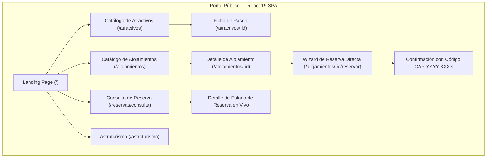

# Arquitectura de Software Frontend (SDD) — Turismo Capilla del Monte

Este documento define la arquitectura técnica, la topología de componentes, los patrones de diseño y la estrategia de optimización para el frontend de la plataforma oficial de Turismo Capilla del Monte.

---

## 1. Visión y Objetivos Arquitectónicos

1. **Rendimiento Máximo y SEO para el Turista:** La experiencia pública carga en menos de 1 segundo en dispositivos móviles y conexiones 4G/3G de montaña, con indexación garantizada mediante marcado estructurado y meta tags canónicas.
2. **Interactividad Fluida en Cliente (SPA pura):** Navegación instantánea sin recargas completas de página utilizando **React Router v7** y transiciones de vista nativas (**View Transitions**).
3. **Identidad Visual Autóctona (Anti-AI Slop):** Cero patrones genéricos de plantillas de inteligencia artificial (degradados violetas, formas flotantes abstractas). Dirección de arte basada en la geología serrana (terracota casonas, verde brote Uritorco, piedra caliza).
4. **SOLID y Container-Presentational:** Separación rigurosa de responsabilidades:
   - **Smart Containers (`< 100 líneas`)**: Orquestan hooks, estado y distribución de datos.
   - **Custom Hooks (`/hooks`, `< 250 líneas`)**: Encapsulan toda la lógica de filtrado, cálculos de estadía y data fetching.
   - **Dumb Components (`/components`, `< 150 líneas`)**: Componentes puramente visuales y testeables.

---

## 2. Topología de la Aplicación en `apps/portal-turismo`

La aplicación está construida como una **Single Page Application (SPA)** de alto rendimiento con **React 19.3 + Vite 8 + Tailwind CSS v4**:

```text
apps/portal-turismo/
├── public/                       # Assets estáticos, favicons e imágenes de referencia
├── src/
│   ├── assets/                   # Iconografía vectorial e ilustraciones oficiales
│   ├── components/               # Jerarquía de Componentes por Dominio
│   │   ├── accommodations/       # Módulo de Alojamientos (HU-04, HU-05, HU-06)
│   │   │   ├── AccommodationsCatalogContainer.tsx  # Smart Container principal
│   │   │   ├── components/       # Componentes de presentación (Tabs, Pills, Cards, Header)
│   │   │   │   ├── AccommodationCard.tsx
│   │   │   │   ├── AccommodationsEmptyState.tsx
│   │   │   │   ├── AccommodationsFilterPills.tsx
│   │   │   │   ├── AccommodationsHeader.tsx
│   │   │   │   ├── AccommodationsMapModal.tsx
│   │   │   │   ├── AccommodationsTypeTabs.tsx
│   │   │   │   └── FloatingMapTrigger.tsx
│   │   │   ├── detail/           # Ficha técnica de detalle (HU-05)
│   │   │   └── hooks/            # useAccommodationsFilter (capacidad, tipos, amenidades)
│   │   ├── attractions/          # Módulo de Paseos y Atractivos (HU-02, HU-03)
│   │   ├── booking-inquiry/      # Búsqueda pública de reserva por código
│   │   ├── booking-wizard/       # Asistente multi-paso de reserva directa (HU-06)
│   │   ├── home/                 # Componentes modulares de la Landing Page
│   │   │   ├── AstrotourismTeaser.tsx
│   │   │   ├── AttractionsSection.tsx
│   │   │   ├── ExperiencesGrid.tsx
│   │   │   ├── FeaturedCabins.tsx
│   │   │   ├── HeroSearchBar.tsx
│   │   │   └── HeroSection.tsx
│   │   ├── layout/               # Shell institucional (AppLayout.tsx, Navbar, Footer)
│   │   └── ui/                   # Primitivas accesibles (CustomDatePicker, CustomSelect)
│   ├── data/                     # Mock data estructurada y tipada (mock-places.ts)
│   ├── pages/                    # Vistas completas montadas por React Router
│   │   ├── AccommodationBookingWizardPage.tsx  # /alojamientos/:id/reservar
│   │   ├── AccommodationDetailPage.tsx         # /alojamientos/:id
│   │   ├── AccommodationsPage.tsx              # /alojamientos
│   │   ├── AstrotourismPage.tsx                # /astroturismo
│   │   ├── AttractionDetailPage.tsx            # /atractivos/:id
│   │   ├── AttractionsPage.tsx                 # /atractivos
│   │   ├── BookingInquiryPage.tsx              # /reservas/consulta
│   │   └── HomePage.tsx                        # / (Landing institucional)
│   ├── services/                 # Cliente HTTP tipado con fetch nativo
│   │   └── api.ts                # Conexión al backend NestJS (http://localhost:3001/api/v1)
│   ├── styles/                   # Tokens de diseño y directivas Tailwind v4
│   │   └── global.css
│   ├── App.tsx                   # Árbol central de rutas públicas (React Router v7)
│   └── main.tsx                  # Entry point con ReactDOM.createRoot
├── index.html                    # Entrada HTML con metadatos OpenGraph y Schema.org JSON-LD
├── tsconfig.json                 # Configuración TypeScript para bundler Vite
├── vite.config.ts                # Bundler Vite 8 con Rolldown, Tailwind v4 y code-splitting
└── package.json
```

---

## 3. Mapa de Navegación y Rutas del Cliente



---

## 4. Decisión Arquitectónica (ADR): React SPA (Vite) vs SSR y Estrategia de SEO

### 4.1 Contexto y Criterio Pedagógico de Cátedra
Por lineamiento explícito de la cátedra de **Programación III**, se determinó la restricción formal de **no utilizar meta-frameworks orientados a SSR/SSG (como Astro o Next.js)**. El propósito pedagógico de esta restricción es:
1. Evaluar el dominio de los fundamentos de ingeniería de software en frontend: ciclo de vida de componentes React, custom hooks, gestión de estado en cliente y arquitectura en capas.
2. Construir una Single Page Application (SPA) pura donde el enrutamiento (`react-router-dom`), la navegación y el consumo de APIs REST se resuelvan explícitamente desde el cliente.
3. Comprender en profundidad el rol de los bundlers modernos (**Vite** con **Rolldown**) en la optimización de assets y code-splitting.

### 4.2 Desafíos de SEO en una SPA Pura
En una SPA tradicional basada en Client-Side Rendering (CSR):
* **Scrapers Sociales sin Motor JavaScript:** Aplicaciones como WhatsApp, Telegram, Facebook y Twitter/X no ejecutan bundles JS cuando un usuario comparte un enlace; únicamente leen el HTML estático inicial recibido por HTTP.
* **Tiempos de Indexación:** Aunque Googlebot ejecuta JavaScript, el renderizado en dos fases puede demorar la extracción de contenido respecto a una página con HTML pre-estructurado.

### 4.3 Estrategia de Mitigación y Optimización de SEO en Cliente

Para maximizar la visibilidad y compartibilidad del portal sin violar las directivas pedagógicas de la cátedra, se implementaron cuatro técnicas complementarias:

1. **Metadatos Canónicos y OpenGraph en `index.html`:**
   - Inyección de etiquetas `<meta property="og:title">`, `<meta property="og:description">`, `<meta property="og:image">` con URLs absolutas y `<meta property="og:locale" content="es_AR">`.
   - Garantiza que al compartir cualquier enlace del portal en mensajería móvil o redes sociales, se renderice de forma instantánea una tarjeta visual con fotografía de las sierras, título institucional y descripción del destino.

2. **Marcado Estructurado Schema.org (JSON-LD):**
   - Inclusión en el `<head>` de `index.html` de un bloque `<script type="application/ld+json">` modelando la entidad oficial `TouristDestination`:
     ```json
     {
       "@context": "https://schema.org",
       "@type": "TouristDestination",
       "name": "Capilla del Monte",
       "description": "Portal oficial de turismo de Capilla del Monte, Córdoba. Guía de paseos, Cerro Uritorco y reservas directas.",
       "geo": {
         "@type": "GeoCoordinates",
         "latitude": -30.8608,
         "longitude": -64.5244
       },
       "touristType": ["Turismo de Montaña", "Astroturismo", "Senderismo"]
     }
     ```
   - Proporciona a los motores de búsqueda datos semánticos precisos para *Rich Snippets* y el *Knowledge Graph* de Google.

3. **Optimización de Core Web Vitals (CWV):**
   - **LCP (Largest Contentful Paint) < 800ms:** Precarga de fuentes críticas (`Outfit` y `Plus Jakarta Sans`) y compresión de imágenes de hero.
   - **CLS (Cumulative Layout Shift) = 0:** Dimensiones de aspecto fijas (`aspect-video`, `h-56` fija en cards) que evitan saltos de interfaz durante la carga.
   - **INP (Interaction to Next Paint) < 50ms:** Componentes desacoplados y memoización de filtros complejos con `useMemo` y `useCallback`.

4. **Code-Splitting Funcional con Rolldown en Vite:**
   - La configuración en `vite.config.ts` divide el bundle en fragmentos independientes:
     - `vendor`: React, React DOM, React Router.
     - `gsap`: Motor de animación cargado exclusivamente donde se requiere.
     - `leaflet`: Mapas interactivos aislados para no penalizar la carga inicial de la landing.
   - Resultado: bundle principal de entrada comprimido en ~67 kB gzip.

---

## 5. Arquitectura de Componentes y Reglas SOLID

### 5.1 Desacople Container-Presentational
* **Smart Container:** Coordina el custom hook `useAccommodationsFilter` y distribuye el estado limpio a los subcomponentes.
* **Componentes de Presentación:**
  * `AccommodationsHeader`: Barra de búsqueda de texto, selectores de fecha (`CustomDatePicker`) y selector de huéspedes.
  * `AccommodationsTypeTabs`: Selector de pestañas por categoría canónica (Cabañas, Hosterías, Hoteles/Posadas, Departamentos).
  * `AccommodationsFilterPills`: Píldoras multi-selección de comodidades (WiFi, Pileta, Estacionamiento, Pet-friendly, Asador) y control de ordenamiento.
  * `AccommodationCard`: Renderizado visual con safe access tipado, cálculo dinámico de tarifa total por estadía y navegación mediante `<Link>`.
  * `AccommodationsEmptyState`: Estado vacío con botón de restablecimiento de filtros.

### 5.2 Resiliencia y Data Fetching Híbrido
* `useAccommodationsFilter` implementa un patrón híbrido: consulta la API REST de alojamientos (`/api/v1/accommodations`) y, en caso de indisponibilidad del servicio local o desconexión, realiza un fallback transparente a `MOCK_PLACES`, manteniendo la interfaz 100% operativa para pruebas y desarrollo.

---

## 6. Integración con el Repositorio Backend Multirepo

El frontend consume la API provista por el repositorio independiente **`Turismo-Capilla-Backend`**:
* **URL Base de Desarrollo:** `http://localhost:3001/api/v1`
* **Endpoints Principales:**
  * `GET /health`: Comprobación de estado del servicio.
  * `GET /accommodations`: Catálogo de alojamientos con filtros por capacidad y fechas.
  * `GET /accommodations/:id`: Ficha técnica y comodidades.
  * `POST /bookings`: Creación transaccional de reservas con prevención de overbooking.
  * `POST /bookings/lookup`: Consulta pública por código de reserva y correo.
  * `GET /attractions`: Catálogo de atractivos y paseos turísticos.
